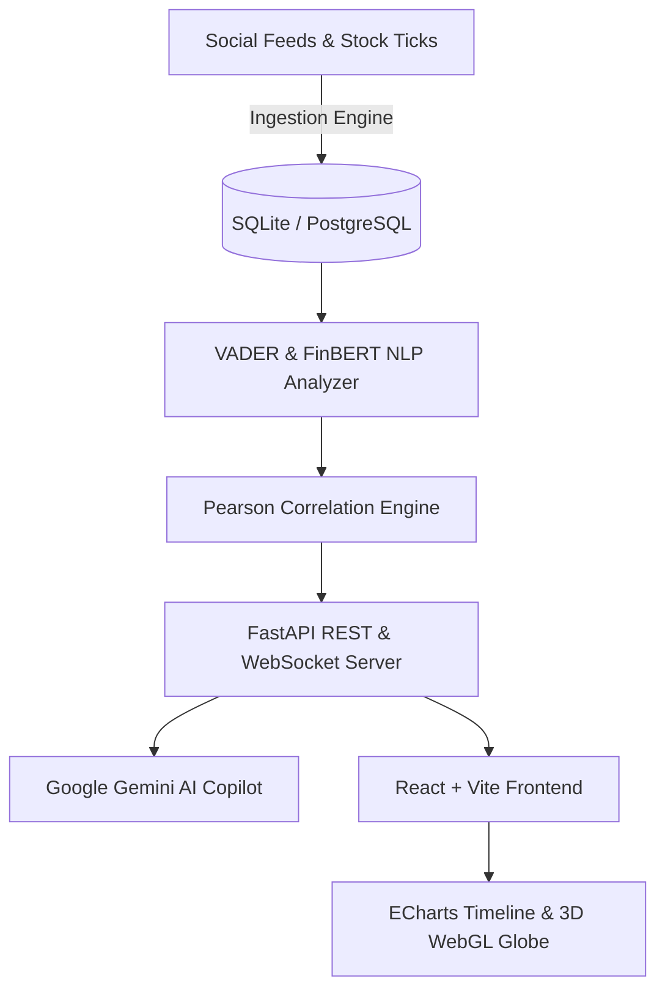

# 🌊 TradeFlow — Market Intelligence & Sentiment Correlation Platform

[](https://opensource.org/licenses/MIT)
[](https://www.python.org/)
[](https://fastapi.tiangolo.com/)
[](https://reactjs.org/)
[](https://vitejs.dev/)
[](https://tailwindcss.com/)
[](https://threejs.org/)
[](https://ai.google.dev/)

**TradeFlow** is an institutional-grade, real-time market intelligence and sentiment correlation platform. It combines high-frequency social stream ingestion, natural language processing (VADER & FinBERT sentiment engines), rolling Pearson correlation scoring, and AI-driven trading signals with an interactive 3D WebGL interface and a Google Gemini AI Copilot assistant.

---

## 🌟 Key Features

- **📊 Real-Time Sentiment vs Price Correlation**: Overlays rolling sentiment scores with live tick prices for mega-cap equities (**Tesla, Apple, NVIDIA, Microsoft, Meta, Amazon, Alphabet, Netflix**).
- **🤖 Pluggable AI Copilot Assistant**: Integrated with **Google Gemini API** (`gemini-1.5-flash`) and live database telemetry to answer real-world financial questions, sentiment scores, and asset outlooks.
- **⚡ AI Trading Signals Engine**: Algorithmic BUY / SELL signal generation backed by Pearson correlation coefficients and sentiment confidence scores.
- **🌍 Master 3D WebGL Backdrop**: Interactive Three.js/React Three Fiber floating planet with live financial exchange markers (NYSE, NASDAQ, LSE, TSE, SGX, BSE).
- **🔍 Command Palette (`Ctrl + K`)**: Rapid asset search modal supporting full company names (*Tesla, Inc.*, *Apple Inc.*, *NVIDIA Corporation*, etc.) and ticker symbols.
- **🧭 Multi-Tab Navigation**: Seamless switching between **Overview**, **Markets**, **Sentiment**, **Signals**, **Watchlist**, **Alerts**, **News**, **Analytics**, and **Settings**.
- **🌙 Cyberpunk Dark & Light Mode**: Persistent theme toggle with custom glassmorphism panels.
- **📥 Quantitative Dataset Export**: One-click CSV export of sentiment and price correlation matrices.

---

## 🏗️ System Architecture



---

## 🚀 Getting Started

### Prerequisites
- **Node.js** (v18+)
- **Python** (v3.9+)
- **npm** or **yarn**

### 1. Repository Setup
```bash
git clone https://github.com/THANAY-KRISHNA/market-intelligence-platform.git
cd market-intelligence-platform
```

### 2. Backend Setup
```bash
cd backend
python -m venv venv

# On Windows:
venv\Scripts\activate
# On macOS/Linux:
# source venv/bin/activate

pip install -r requirements.txt
python -m app.main
```
The FastAPI backend server will start at `http://localhost:8000`.

*(Optional)* Set your Google Gemini API key:
```bash
set GEMINI_API_KEY="your-gemini-api-key"
```

### 3. Frontend Setup
Open a new terminal window:
```bash
cd frontend
npm install
npm run dev
```
Access the application at `http://localhost:5173`.

---

## 📡 API Endpoints Summary

| Method | Endpoint | Description |
| :--- | :--- | :--- |
| `GET` | `/api/market-summary` | Live summary for all tracked tickers |
| `GET` | `/api/correlation/{ticker}` | Rolling sentiment vs price timeline & Pearson score |
| `POST` | `/api/copilot/chat` | AI Copilot query endpoint (Gemini AI + DB Telemetry) |
| `GET` | `/api/alerts` | Active market anomaly and spike alert notifications |
| `GET` | `/api/dashboard` | Macro Fear & Greed score and top movers |
| `WS` | `/api/ws` | Real-time WebSocket tick stream |

---

## 🛠️ Built With

- **Frontend**: React 18, Vite, TailwindCSS, Framer Motion, Three.js (`@react-three/fiber`), ECharts (`echarts-for-react`), Lucide Icons, Canvas Confetti
- **Backend**: Python, FastAPI, SQLAlchemy, SQLite/PostgreSQL, NLTK VADER, FinBERT, Google Gemini AI API, WebSockets

---

## 👤 Author

**THANAY-KRISHNA**
- **GitHub**: [@THANAY-KRISHNA](https://github.com/THANAY-KRISHNA)
- **Repository**: [market-intelligence-platform](https://github.com/THANAY-KRISHNA/market-intelligence-platform.git)

---

## 📄 License

This project is licensed under the MIT License — see the [LICENSE](LICENSE) file for details.
